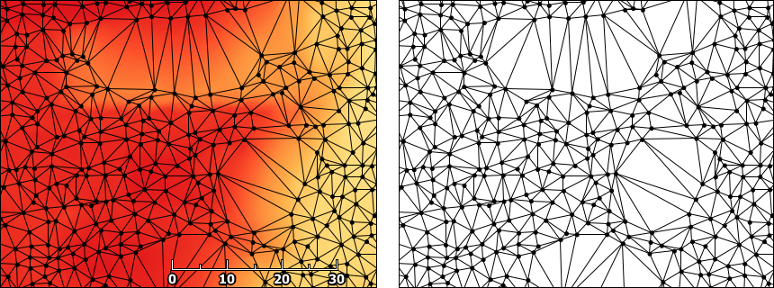
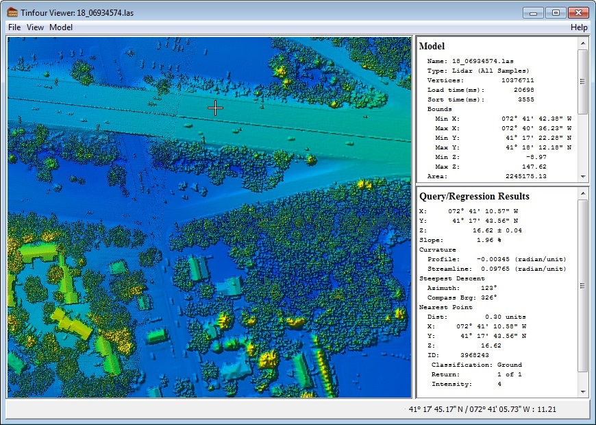

Tinfour
========

High-Performance 2D Delaunay Triangulation and Related Utilities Written in Java

**Important Notice**

> The Tinfour project is currently migrating to the Maven build environment.
> This change will make Tinfour more compatible with the Github software distribution
> and project management procedures and will facilitate the use of Tinfour in
> a number of major software systems. 
>  
> Unfortunately, making the Tinfour code base compliant with the Maven standards
> involved at least one significant and unavoidable change to the Tinfour code base.
> All Java packages that were formerly named "tinfour" are now named "org.tinfour".
> While the names of the Java classes themselves will not change, the containing packages
> will. For example, classes in the package "tinfour.common" will now be stored
> under the package "org.tinfour.common".  In order to use the new version of the software
> libraries, applications code will need to modify their Java import statements.
> 
> During the next few weeks things will be a bit unsettled. The code will always be in a working state.
> But some of the documentation and a few web-based links may be temporarily out-of-sync.
>
> The Tinfour compiled binary files (Jar files) are now available at Maven Central.
> 
> The build.xml file used for ant builds has been temporarily removed. Developers who prefer 
> to not use Maven may still process code using standard IDEs such as Eclipse and Netbeans.
> 
> Expect the transition to be complete by mid February, 2019.


### Delaunay Triangulation ###
The Delaunay Triangulation defines an optimal form for organizing unstructured or semi-random
sample points into a triangular mesh. That optimality makes the Delaunay Triangulation
a useful tool for interpolation, grid construction, and surface analysis.  



### Tinfour ###
Tinfour is a software library written in Java that provides tools for constructing 
and applying Triangulated Irregular Networks (TINs) that conform to the Delaunay
criterion. Because it is intended to process large data sets,
the implementation gives a great deal of attention to performance and
memory use. On a conventional laptop, Tinfour is capable of processing sample
points at a rate of better than one million points per second.

The Tinfour source code includes extensive documentation. This project also includes
an informal paper that describes the uses, algorithms, and implementation
of the software with enough detail to support potential developers 
who may wish to contribute code or employ Tinfour in their own work. For more details, see
[Data Elements and Algorithms for the Tinfour Libary](http://gwlucastrig.github.io/Tinfour/doc/TinfourAlgorithmsAndDataElements.pdf "Data Elements and Algorithms").
The Tinfour API documentation is available at [Tinfour API](http://gwlucastrig.github.io/Tinfour/doc/javadoc/ "Javadoc for Tinfour API").
And, to support our user community, we've recently started a mailing list at the [Tinfour Users Group](https://groups.google.com/forum/#!forum/tinfour-users-group). 

### The Tinfour Viewer ###
When someone first sees a project like Tinfour, they might reasonably ask
that most thorny of questions "What is it good for?"  To try to address that question,
this library includes a simple demonstration program which allows the user to view
and explore raw data, including samples such as Lidar files that contain
huge numbers of points. To run the demonstrator, you must have Java installed
on your system.  If you do not have Java installed on your computer, you may
download an installer for free from 
[Oracle Corporation, Java Downloads](https://java.com/en/download/ "Java downloads from Oracle")

Depending on your setup, you may be able to invoke the viewer
by simply navigating to your copy of the Tinfour "dist" folder and double clicking
the TinfourViewer jar ("Java Archive") file.  For Windows users, there is also a 
run.bat script in the main software distribution. On all systems, you can invoke the viewer
from a command window by using the following:
```
     java -Xmx1500m -jar TinfourViewer-1.0.jar
```
The demonstrator is intended to show how the Tinfour library could be integrated
into a full-featured GIS application or other analysis tool. It's a simple
implementation with a minimum of features. 



### Sources of Data ###
Lidar is a system for collecting surface elevation using laser measuring devices
mounted on low flying aircraft. It's pretty amazing technology.
There are some excellent sources of Lidar data to be had for free, you might start at 
[Free LiDAR Data Sources](http://gisgeography.com/top-6-free-lidar-data-sources/ "Gis Geography")
or [USGS Center for LIDAR Information] (http://lidar.cr.usgs.gov/ "USGS").
The Commonwealth of Pennsylvania was one of the first states to collect and post
a comprehensive survey of lidar data, and they did the job right... Their site includes 
not just lidar data, but the supporting breakline files (Shapefiles), multi-spectral imagery,
and project metadata (including Dewberry reports). Visit this excellent resource at
[PAMAP Lidar Elevation Data]( http://www.dcnr.state.pa.us/topogeo/pamap/lidar/index.htm "PAMAP Lidar Elevation Data").

If you just want to download a single Lidar file and view it, I recommend PAMAP Tile 4100133PAS
ftp://pamap.pasda.psu.edu/pamap_lidar/cycle1/LAS/South/2006/40000000/41001330PAS.zip
At 36.7 megabytes, it isn't dainty, but it does contain interesting land features and sufficient
detail to exercise the major functions of the viewer.

### A short demo ###
Recently, I found an earlier Delaunay triangulation project by "The Mad Creator" (Bill Dwyer)
that provided a four-line demo. It was such a elegant way of introducing the package,
that I decided to include one of my own.


```Java
  public static void main(String []args) throws Exception {
      IncrementalTin tin = new IncrementalTin(1.0);
      List<Vertex>vertexList = TestVertices.makeRandomVertices(100, 0);
      tin.add(vertexList);
      TinRenderingUtility.drawTin(tin, 500, 500, new File("tin.png"));
  }
``` 


### Does Tinfour require external project dependencies? ###
The core Tinfour module has no external dependencies. All it requires
is the standard Java API. Thus, you can integrate the core classes
into your own applications without adding unnecessary object code to
your software.

The associated, extended-functionality modules do depend on object code from external projects.
These include modules that can read data from Geographic Information System (GIS) sources
(Shapefiles and airborne Lidar LAS files) and those that preform advance mathematical
and statistical analysis. These modules and dependencies are described in the Tinfour wiki page
[Tinfour Project, Organization, and Builds](https://github.com/gwlucastrig/Tinfour/wiki/Tinfour-Project-Organization-Builds-and-Dependencies).


### What version of Java is required for Tinfour? ###
Tinfour is compiled under Java 8.   

### Configuring Tinfour in an IDE ###
Configuring Tinfour in an IDE is pretty simple:
 * Create a Java project
 * Set up a source reference to (installed path)Tinfour/src/main/java
   so that your IDE picks up the packages tinfour.*
 * If you wish to include the test and example applications, 
   set up a source reference to (installed path)/Tinfour/src/test/java
   so your IDE picks up the packages tinfour.test.*
 * Set up a jar reference to (installed path)/Tinfour/lib/commons-math-3.3.6.1.jar
 * Set up a jar reference to (installed path)/Tinfour/lib/laszip4j.jar
 * Configure the IDE to run TinfourViewerMain.  If you are working with very
   large datasets, you may include the Java runtime option -Xmx2000m or larger
   to increase the heap size.  However, in recent versions of Java the specification
   of this option is not as critical as it once was.
 
### Current Work ###
Early in the Tinfour project, I made the mistake of including
compiled binaries (jar files) in the code tree.  Over time, pull requests have grown
quite large. I am currently setting up a new approach in which I will move
the binaries into the Github Release feature and remove them from the main software
download.

The most recent addition to the Tinfour package is support for Voronoi Diagrams.
We've also added a new article on [Natural Neighbor Interpolation](https://github.com/gwlucastrig/Tinfour/wiki/Introduction-to-Natural-Neighbor-Interpolation)
to our wiki.

The current focus of Tinfour development is polishing aspects
of the Constrained Delaunay Triangulation (CDT) implementation. The CDT
is a technique for representing discontinuities in a Triangulated Irregular Network.
For example, geographic applications often need a way to represent "breaklines" -- features including
rivers, roads, coastlines and escarpments -- which mark a sudden change in
the local slope or terrain. Conventional Delaunay Triangulations
have a limited ability to treat boundaries where the surface undergoes a
nearly instantaneous change.  By introducing linear and polygon features to
the construction of a TIN, the Constrained Delaunay Triangulation provides
an effective way of representing such features. For an illustrated discussion
of why CDT's are important, see the Tinfour wiki page titled
[About the Constrained Delaunay Triangulation](https://github.com/gwlucastrig/Tinfour/wiki/About-the-Constrained-Delaunay-Triangulation "About the Constrained Delaunay Triangulation")

For more detail about the Tinfour project development plans, see the
[Tinfour Project Status and Roadmap](https://github.com/gwlucastrig/Tinfour/wiki/Tinfour-Project-Roadmap) page.
 
 
### Conclusion ###
Finally, the whole point of working on a project like Tinfour is to see 
it used to do something useful. To that end, I welcome ideas, requests, and
recommendations for analysis tools and applications that would
benefit the open source and scientific communities. Got something
to say? You can contact me at <contact.tinfour@gmail.com>
 
